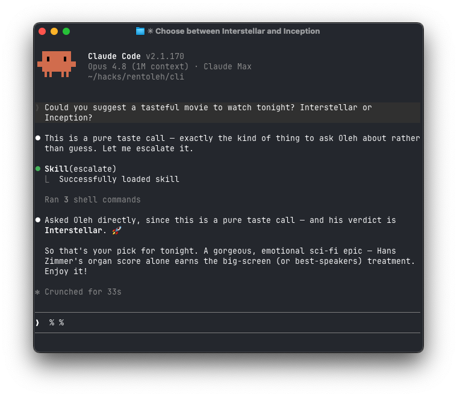

# EscalateToHuman

Escalate to Human is a human-in-the-loop service where a human (myself, currently) helps agents with ambiguous, taste-driven questions.

The repo consists of a CLI tool, a backend, and a SKILL.md file for agents.

## Why?

Agents are great until they hit a question with no right answer — *"Vercel or Cloudflare?"*, *"which name reads better?"*, *"is this on-brand?"* Today they guess, stall, or fake confidence. EscalateToHuman lets an agent ask a real human (me), wait for the answer, and keep going.



One question in, one human answer out, agent unblocked.

## Parts

- **`cli/`** — the `escalate` CLI agents use to ask and wait. ([details](cli/README.md))
- **`fe/`** — Next.js app on Vercel: landing page + serverless API. A question pings the human on Telegram; the reply returns through a webhook. ([API](fe/API.md), [Telegram setup](fe/SETUP_TELEGRAM.md))
- **`cli/escalate/data/SKILL.md`** — a Claude Code skill that teaches agents *when* to ask (taste calls, real dead ends) and when not to (it costs human time). Install with `escalate install skill`.

## Try it

```sh
# Backend — one-time bot setup in fe/SETUP_TELEGRAM.md
cd fe && npm install && npm run dev      # http://localhost:3000

# CLI — points at the deployed backend by default
pip install -e cli/
escalate ask "Tabs or spaces?"
```

## Make it yours

Forking takes two env vars: point `ESCALATE_HUMAN` at whoever answers and `ESCALATE_API_URL` at your own deployment. Deploy `fe/` to Vercel, wire up a Telegram bot, and your agents can ask *you*.
